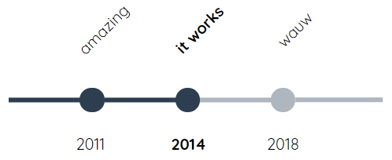

# kc-timeline
A timeline WebComponent, inspired by https://codepen.io/cjl750/pen/MXvYmg

The changes made primarily concern being able to easily use it within [Reveal.js](https://github.com/hakimel/reveal.js/), a presentation framework we use @ [Info Support Kenniscentrum](https://training.infosupport.com/). Deployment should be as easy as possible, this webcomponent probably being the first of multiple that we will be using within presentations.



## Usage

`<kc-timeline>` is the element name. Bind timeline data using the property `events`.

```html
<kc-timeline></kc-timeline>

<script>
let timeline = document.querySelector('kc-timeline');
timeline.events = [
	{
		year: 2011,
		caption: 'amazing',
		description: 'everyone loved it'
	},
	{
		year: 2014,
		caption: 'it works',
		description: 'also important'
	},
	{
		year: 2018,
		caption: 'wauw',
		description: 'expressions of owen wilson'
	}
];
</script>
```
