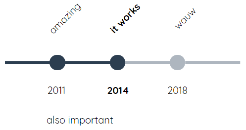

# kc-timeline
A timeline WebComponent, inspired by https://codepen.io/cjl750/pen/MXvYmg

A couple of changes were made in the implementation, primarily because of being able to easily use it within [Reveal.js](https://github.com/hakimel/reveal.js/), a presentation framework we use @ [Info Support Kenniscentrum](https://training.infosupport.com/). Deployment should be as easy as possible, this webcomponent probably being the first of multiple that we will be using within presentations.

<sub>The pen uses a SASS variable `$num-dots` to track the number of dots and distribute width of the line accordingly, but it appears very buggy. For one, the number in `$num-dots` is double what is actually visible. Plus, with only three visible dots and `$num-dots` set to 6, the timeline is rendered wrong.</sub>

This timeline looks the same with the default settings, but works with any number of dots. The look and feel is less configurable than the original pen, I've simply tailored it to what I need.



## Usage

`<kc-timeline>` is the element name. Bind timeline data using the property `events`.

```html
<kc-timeline></kc-timeline>

<script>
let timeline = document.querySelector('kc-timeline');
timeline.events = [
	{
		year: 2011,
		caption: 'amazing',
		description: 'everyone loved it'
	},
	{
		year: 2014,
		caption: 'it works',
		description: 'also important'
	},
	{
		year: 2018,
		caption: 'wauw',
		description: 'expressions of owen wilson'
	}
];
</script>
```
